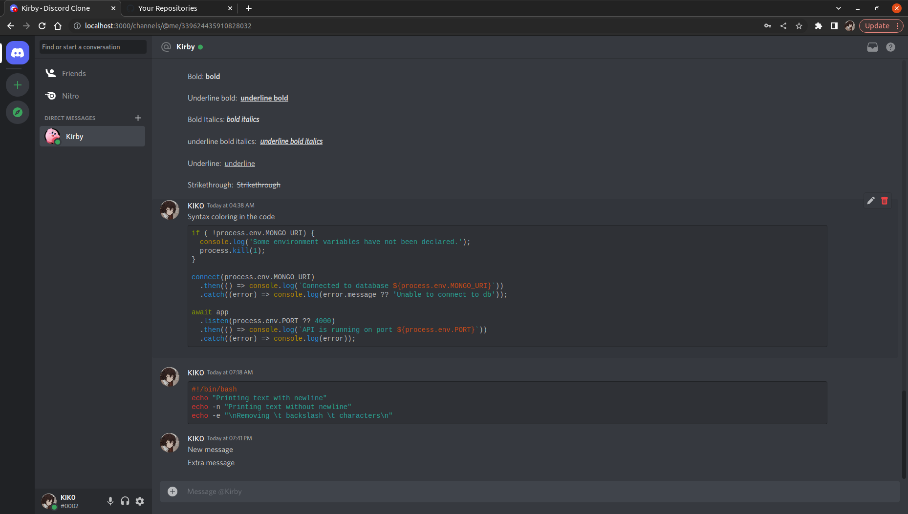
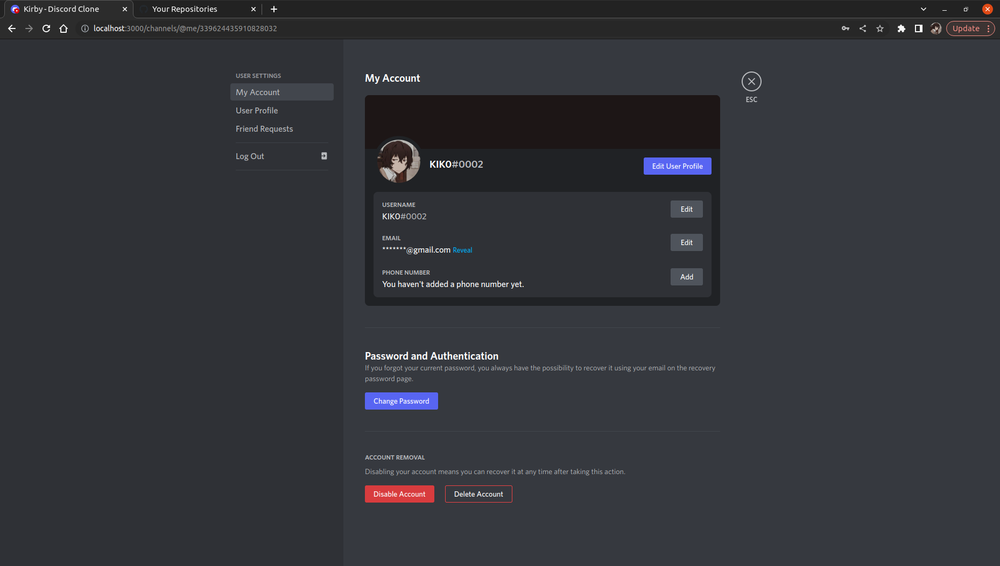

<h1 align="center">
	
</h1>

<h3 align="center">
  Discord Clone built in ReactJS and NestJS
  <p>Project in development (WIP)</p>
</h3>

<p align="center">
  

  

  

  

  
</p>

<p align="center">
  <a href="#-about-the-project">About The Project</a>&nbsp;&nbsp;&nbsp;|&nbsp;&nbsp;&nbsp;
  <a href="#-technologies">Technologies</a>&nbsp;&nbsp;&nbsp;|&nbsp;&nbsp;&nbsp;
  <a href="#-getting-started">Getting Started</a>&nbsp;&nbsp;&nbsp;|&nbsp;&nbsp;&nbsp;
  <a href="#-useful-resources">Useful resources</a>&nbsp;&nbsp;&nbsp;|&nbsp;&nbsp;&nbsp;
  <a href="#-license">License</a>
</p>

## 👨🏻‍💻 About the project

<h1 align="center">
	
  	
</h1>

<p>This is a project developed in ReactJS for the frontend and NestJS for the backend in conjunction with TypeScript, where it displays an interface almost identical to Discord.

This project includes an application based on electron.</p>

## 🚀 Technologies

Technologies that I used to develop this app

- [ReactJS](https://en.reactjs.org)
- [NestJS](https://nestjs.com)
- [TypeScript](https://www.typescriptlang.org)
- [Socket.IO](https://socket.io)
- [Sass](https://sass-lang.com)
- [MongoDB](https://mongodb.com)

## 💻 Getting started

### Requirements

- [Docker](https://www.docker.com)
- [Node.js](https://nodejs.org/en/)
- [Yarn](https://classic.yarnpkg.com/)
- [MongoDB](https://mongodb.com) (Only if you don't use docker)

**Clone the project and access the folder**

```bash
git clone https://github.com/ernesto-glz/discord-clone.git

cd discord-clone
```

**Follow the steps below**

```bash
# Install the dependencies
chmod +x ./scripts/install-dependeces.sh
./scripts/install-dependeces.sh

# Generate SSH keys
chmod +x ./scripts/generate-keys.sh
./scripts/generate-keys.sh

# NOTE: Keep in mind that if you generate a new key all active tokens are invalidated

# Run the app (Docker)
yarn run docker:dev

# Run the app
cd backend && yarn start:dev
cd frontend && yarn dev:web

# or run in electron
cd frontend && yarn dev
```

## 📝 Useful resources

- [https://discord.com/developers](https://discord.com/developers/docs/)
- [https://github.com/matrix-org/matrix-react-sdk](https://github.com/matrix-org/matrix-react-sdk)
- [https://github.com/vector-im/element-web/](https://github.com/vector-im/element-web/)
- [https://github.com/codea-live/dclone](https://github.com/codea-live/dclone)

## 📝 License

This project is under the MIT license. See the [LICENSE](https://github.com/ernesto-glz/discord-clone/blob/master/LICENSE) for more information.
